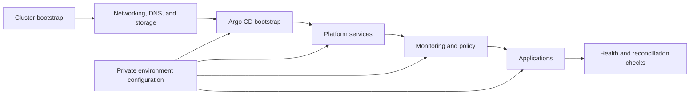

# Kubernetes GitOps Homelab

This repository documents the architecture and operating workflow for a
multi-environment Kubernetes homelab managed with Argo CD.

The environment-specific application definitions, Helm values, hostnames, and
secrets live in private downstream repositories. Keeping them separate makes
the architecture public without exposing the configuration of a running home
network.

## Architecture



The system is split into layers so that cluster lifecycle, platform services,
and workloads can change independently:

| Layer | Responsibility |
| --- | --- |
| Cluster | Kubernetes distribution, nodes, networking, storage, and DNS |
| GitOps | Argo CD bootstrap, projects, synchronization order, and promotion |
| Platform | Ingress, identity, external secrets, and policy controllers |
| Observability | Metrics, dashboards, logs, and alert routing |
| Applications | Namespaces, routes, application values, and data services |

## Deployment flow

The intended path for a new or rebuilt environment is:

1. Create the cluster from a known machine or cloud configuration.
2. Check node readiness, networking, DNS, ingress, and storage.
3. Bootstrap Argo CD and register the repositories required by that environment.
4. Reconcile platform services before monitoring and application workloads.
5. Check sync health, workload readiness, service routes, and secret references.
6. Promote changes through environment-specific values rather than copying
   whole application definitions.
7. Roll back through Git, or rebuild the cluster when its platform state is no
   longer trustworthy.

## Environments

| Environment | Use |
| --- | --- |
| Development | Fast, disposable infrastructure and workload experiments |
| Staging | Upgrade, policy, and recovery rehearsal |
| Data | Stateful-service and storage experiments |
| Production | Stable workloads promoted from the same GitOps structure |

New Kubernetes or node-image versions are introduced in an isolated cluster.
Applications move only after the replacement environment passes its health
checks, leaving the previous cluster available as the rollback boundary.

## Platform choices

| Concern | Approach |
| --- | --- |
| Kubernetes | K3s and Talos experiments |
| Reconciliation | Argo CD app-of-apps |
| Networking | Cilium, ingress, and service-mesh experiments |
| Secrets | Vault with External Secrets |
| Policy | Kyverno admission policies |
| Metrics and logs | Prometheus, Grafana, and Loki/Elastic experiments |

These choices describe the operating model. Concrete versions and
environment-specific values belong to the downstream deployment repositories.

## Using this repository

The current default branch is documentation-only. Use it as the starting point
for designing a GitOps repository split or reviewing an existing one:

- keep cluster creation separate from application reconciliation;
- make service dependencies and sync waves explicit;
- keep secret values outside Git while retaining declarative references;
- document health checks before automating promotion; and
- rehearse restoration in a disposable environment.

The included dev container provides a small documentation workspace:

```sh
git clone https://github.com/T-Py-T/kubernetes-gitops-homelab.git
cd kubernetes-gitops-homelab
code .
```

Open the folder in VS Code and choose **Reopen in Container** when prompted.

## Validation checklist

Before promoting a downstream environment, verify:

- every node reports ready;
- DNS, ingress, networking, and storage checks pass;
- Argo CD applications are synchronized and healthy;
- required secret references resolve without exposing values;
- workloads pass readiness checks and expected routes respond; and
- rollback or rebuild instructions have been exercised for the change.

## Related repositories

- [`nix-homelab`](https://github.com/T-Py-T/nix-homelab) manages reproducible
  host and service configuration for the successor environment.
- [`devops-install-scripts`](https://github.com/T-Py-T/devops-install-scripts)
  contains reusable CI/CD and deployment setup scripts.

## License

The current documentation and repository-specific configuration are available
under the [MIT License](LICENSE). Historical and third-party material is not
relicensed; see [THIRD_PARTY_NOTICES.md](THIRD_PARTY_NOTICES.md).
