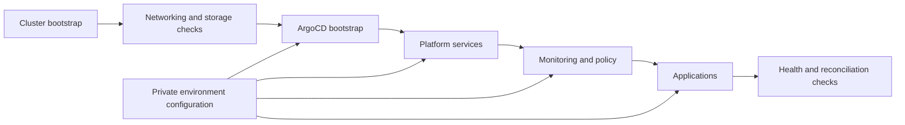

# Kubernetes Homelab: Architecture and Operating Case Study

This repository documents the architecture and intended operating model for a
multi-environment Kubernetes homelab. The point is not the applications it
runs; the point is the deployment system around them: isolated clusters,
ordered GitOps reconciliation, security boundaries, observability, and a
rebuild-first recovery model.

> [!IMPORTANT]
> The publication boundary is a new, clean repository initialized from the
> current sanitized tree. Earlier history in this repository included
> environment-specific deployment files, so deleting them from the current
> tree is not a sufficient privacy boundary. Do not publish a branch with that
> ancestry. Cluster-specific ArgoCD applications, Helm values, hostnames, and
> live deployment manifests belong only in private downstream repositories.

## Why this project matters

Cloud deployment examples are easy to make once and hard to operate
repeatedly. This homelab is structured around a stronger question:

**Can a cluster be rebuilt, validated, promoted, and observed through the same
documented path every time?**

The design demonstrates how I approach that problem:

- separate cluster lifecycle from workload configuration;
- reconcile platform, monitoring, and application layers in dependency order;
- test changes in disposable environments before promotion;
- keep secrets and environment-specific endpoints outside public source;
- treat recovery as recreation from declared state instead of manual repair.

## Architecture

The downstream deployment boundary is deliberately split by responsibility:

| Layer | Responsibility | Public boundary |
| --- | --- | --- |
| Cluster | Kubernetes distribution, node lifecycle, CNI, storage, DNS | Architecture and operating model |
| GitOps | ArgoCD bootstrap, projects, sync ordering, promotion | Live definitions remain private |
| Platform | Ingress, service mesh, identity, secrets, policy | Service choices and dependency model |
| Observability | Metrics, dashboards, logging, alert routing | Verification approach and failure signals |
| Applications | Namespaces, routes, application values, data services | Workload inventory is intentionally omitted |

## Deployment contract

A deployment is not considered complete merely because manifests apply. The
intended flow is:

1. Create or rebuild a cluster from a known configuration.
2. Verify node readiness, networking, DNS, ingress, and storage prerequisites.
3. Bootstrap ArgoCD and register only the repositories required for that
   environment.
4. Reconcile platform services before monitoring and application workloads.
5. Validate sync health, workload readiness, service reachability, and secret
   references.
6. Promote the same structure to the next environment with bounded overrides.
7. Roll back through Git or recreate the cluster when platform state is no
   longer trustworthy.

This is the intended repeatability contract for the private implementation,
not a claim that every step is currently automated or has completed
successfully. The public case study does not claim current uptime, production
traffic, successful reconciliation, or a successful recovery drill without a
retained sanitized artifact that proves it.

## Cluster strategy

The design uses multiple purpose-specific clusters to make failure domains and
promotion paths explicit.

| Environment | Primary use | Change posture |
| --- | --- | --- |
| Development | Fast infrastructure and workload experiments | Disposable; optimize for feedback |
| Staging | Production-like validation | Rehearse upgrades and recovery before promotion |
| Data | Stateful services and storage experiments | Prioritize backup and restore behavior |
| Production | Stable end-user workloads | Prefer declared replacement over in-place drift |

The "no in-place upgrades" strategy is intentional: trial a new Kubernetes or
node image in an isolated cluster, validate it, then move workloads while
retaining the previous cluster as the rollback boundary.

## Platform decisions

| Concern | Selected approach | Reasoning |
| --- | --- | --- |
| Lightweight Kubernetes | K3s and Talos experiments | Low-cost clusters with different lifecycle tradeoffs |
| Reconciliation | ArgoCD app-of-apps | Visible dependency ordering and Git-backed rollback |
| Networking | Cilium with ingress/service-mesh experiments | Policy, observability, and load-balancing primitives |
| Secrets | Vault plus External Secrets | Keep secret material out of Git while declaring references |
| Policy | Kyverno | Admission-time guardrails expressed as Kubernetes resources |
| Metrics and logs | Prometheus, Grafana, and Loki/Elastic experiments | Make platform and workload failures inspectable |

## Retained operating record

This case study separates repository evidence from live-cluster claims. The
retained record supports the evolution of the operating design, but it does not
prove that a cluster reached or maintained the declared state.

| Date | Retained repository evidence | What it supports | What it does not prove |
| --- | --- | --- | --- |
| 2025-06-01 | A desired-state snapshot contained separate cluster, platform, monitoring, and application layers | The design was expressed as versioned deployment configuration | Successful reconciliation, service health, or uptime |
| 2025-06-25 | The project record documents removal of environment definitions and a move to separate repositories for finer environment control and staged rebuilds | The project adopted a private multi-repository boundary | A completed migration, promotion, or rebuild |
| 2026-08-02 | The project record marks this case study as historical and identifies the successor project | Later status claims must not be inferred from the earlier configuration | Current cluster state or production operation |

No sanitized deployment logs, test reports, recovery timings, or current
telemetry are retained here. Accordingly, the deployment contract above is an
operating runbook to evaluate, while successful reconciliation, promotion, and
recovery remain unverified outcomes. The next evidence milestone is a
sanitized, current-version recovery drill with timings, failure criteria, and
rollback results.

## What to evaluate

This repository should be judged as an architecture and operating-model case
study:

- Are ownership and security boundaries explicit?
- Is the deployment order deterministic?
- Can an environment be recreated without undocumented console work?
- Are validation and rollback steps part of the design?
- Are planned capabilities clearly separated from retained operating evidence?

## Related public work

- [nix-homelab](https://github.com/T-Py-T/nix-homelab) demonstrates a separate
  but complementary concern: reproducible NixOS and nix-darwin host and service
  configuration.
- [devops-install-scripts](https://github.com/T-Py-T/devops-install-scripts)
  retains reusable deployment and CI examples used across cloud case studies.
