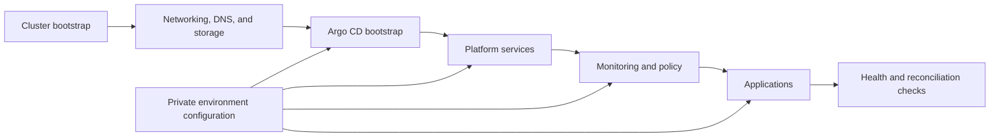

# Kubernetes GitOps Homelab

[](https://github.com/T-Py-T/kubernetes-gitops-homelab/actions/workflows/validate.yml)

**A public blueprint for running a multi-environment Kubernetes homelab with Argo CD, without publishing your home network.**

This repository is the *design*: layers, sync order, promotion and rebuild
rules, written so you can reuse them. The *environment* (application
definitions, Helm values, hostnames and secrets) lives in private downstream
repositories. Splitting them this way lets the architecture be public while
the running configuration stays private.

[Architecture](#architecture) ·
[Getting started](#getting-started) ·
[Walk-through](#walk-through-plan-a-rebuild) ·
[Design choices](#platform-choices) ·
[Contributing](#contributing)

> **Docs-only by design.** The default branch contains no manifests, cluster
> endpoints, secret references or application inventory. There is no live
> demo and no screenshots, because there is nothing public to capture. The
> Mermaid diagram below is the visual.

## Why it's worth a read

- **A clean public/private split.** Reusable design in public; every
  hostname, value and secret in private environment repositories.
- **Layered on purpose.** Cluster, GitOps, platform, observability and
  applications each change on their own schedule.
- **Rebuild over repair.** New Kubernetes or node-image versions land in an
  isolated cluster. The old cluster stays up as the rollback boundary.
- **A runbook you can copy.** [`docs/rebuild-runbook.md`](docs/rebuild-runbook.md)
  turns the principles into an ordered, evidence-based rebuild checklist.
- **A pinned authoring workspace.** The dev container ships kubectl 1.37,
  Helm 4.3 and built-in Kustomize from a digest-pinned image, and never
  starts a cluster.

## Architecture


```mermaid
flowchart LR
    A[Cluster bootstrap] --> B[Networking, DNS, and storage]
    B --> C[Argo CD bootstrap]
    C --> D[Platform services]
    D --> E[Monitoring and policy]
    E --> F[Applications]
    F --> G[Health and reconciliation checks]

    H[Private environment configuration] --> C
    H --> D
    H --> E
    H --> F
```

| Layer | Responsibility |
| --- | --- |
| Cluster | Kubernetes distribution, nodes, networking, storage, and DNS |
| GitOps | Argo CD bootstrap, projects, synchronization order, and promotion |
| Platform | Ingress, identity, external secrets, and policy controllers |
| Observability | Metrics, dashboards, logs, and alert routing |
| Applications | Namespaces, routes, application values, and data services |

## Getting started

### Read it

Start with the [Architecture](#architecture), then the
[rebuild runbook](docs/rebuild-runbook.md).

### Validate the repository

On macOS or Linux, with Python 3, ShellCheck and
[pre-commit](https://pre-commit.com/):

```sh
git clone https://github.com/T-Py-T/kubernetes-gitops-homelab.git
cd kubernetes-gitops-homelab
./scripts/validate.sh
pre-commit run --all-files
```

`validate.sh` checks that the dev container stays pinned (image digest,
feature lock, CLI version, no `latest`, no piped installs, no privileged
mode), that workflows trigger only on `pull_request`, and that the diff has
no whitespace errors. Pull requests also lint the Markdown and build the dev
container.

### Open the authoring workspace

```sh
code .
```

Choose **Reopen in Container** when VS Code prompts. Setup confirms
`kubectl v1.37.0`, `Helm v4.3.0` and `kubectl kustomize`. The container
doesn't start a cluster or connect to any environment.

## Walk-through: plan a rebuild

Use the runbook to dry-run a cluster replacement on paper before you touch a
real environment:

1. **Record the change boundary.** Note current versions, Git revisions,
   required backups and how to send traffic back.
2. **Create an isolated cluster.** Leave the old one running, then check
   `kubectl get nodes -o wide` before any GitOps step.
3. **Check the foundation**, in order: networking, DNS, ingress, then
   storage, using small synthetic workloads.
4. **Bootstrap Argo CD** from your pinned version and register only the
   repositories this cluster needs.
5. **Reconcile by layer**: platform controllers, then observability, then
   stateless apps, then stateful services and restored data.
6. **Exercise recovery** on a bounded synthetic dataset.
7. **Promote or roll back**, and keep the failure log for the next
   rehearsal.

The cluster commands in the runbook are placeholders for your private
environment repository. This public repository can't run them, because it
deliberately has no cluster to point at.

## Environments

| Environment | Use |
| --- | --- |
| Development | Fast, disposable infrastructure and workload experiments |
| Staging | Upgrade, policy, and recovery rehearsal |
| Data | Stateful-service and storage experiments |
| Production | Stable workloads promoted from the same GitOps structure |

Changes are promoted through environment-specific values, not by copying
whole application definitions. Rollback goes through Git, or through a
rebuild when the platform state is no longer trustworthy.

## Platform choices

| Concern | Approach |
| --- | --- |
| Kubernetes | K3s and Talos experiments |
| Reconciliation | Argo CD app-of-apps |
| Networking | Cilium, ingress, and service-mesh experiments |
| Secrets | Vault with External Secrets |
| Policy | Kyverno admission policies |
| Metrics and logs | Prometheus, Grafana, and Loki/Elastic experiments |

These describe the operating model. Exact versions and values belong in the
private environment repositories.

## Design principles

- Keep cluster creation separate from application reconciliation.
- Make service dependencies and sync waves explicit.
- Keep secret values out of Git while keeping declarative references.
- Write down health checks before automating promotion.
- Rehearse restoration in a disposable environment.

## Promotion checklist

Before promoting a downstream environment, check that:

- every node reports ready;
- DNS, ingress, networking and storage checks pass;
- Argo CD applications are synchronized and healthy;
- required secret references resolve without exposing values;
- workloads pass readiness checks and expected routes respond; and
- rollback or rebuild instructions have been exercised for the change.

## Related repositories

- [`nix-homelab`](https://github.com/T-Py-T/nix-homelab): reproducible host
  and service configuration for the successor environment
- [`devops-install-scripts`](https://github.com/T-Py-T/devops-install-scripts):
  reusable CI/CD and deployment setup scripts

The private environment repositories aren't linked or described here.

## Contributing

Improvements to the design, the runbook or the checklists are welcome, as
long as they stay environment-neutral.

1. Fork the repository and branch from `main`.
2. Never add hostnames, IPs, kubeconfigs, tokens or real secret references.
3. Run `./scripts/validate.sh` and `pre-commit run --all-files`.
4. Open a pull request. CI also runs ShellCheck, markdownlint and a dev
   container build.

Report sensitive findings privately through [SECURITY.md](SECURITY.md).

## License

The current documentation and repository-specific configuration are available
under the [MIT License](LICENSE). Historical and third-party material is not
relicensed; see [THIRD_PARTY_NOTICES.md](THIRD_PARTY_NOTICES.md).
